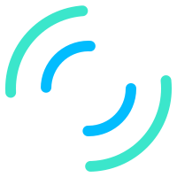

# 数据可视化 - 图表组件库

> 本项目为数据可视化之图表组件库，主要用于配合[数据可视化 - 外卖业务数据大屏](https://github.com/MrEnvision/data-vision-screen)使用，技术栈使用 Vue3.0 + rollup打包 + SVG，具体详见：[课程官网](http://www.youbaobao.xyz/datav-docs/) + [个人笔记](https://github.com/MrEnvision/data-vision-libs)。
>
> TIP：更多内容详见[数据可视化专题](https://github.com/MrEnvision/data-vision)！！！


## 0. 组件介绍

- [IconUsing](./src/components/IconUsing/IconUsing.vue) - Icon使用组件
- [IconLoading](./src/components/IconLoading/IconLoading.vue) - 加载Icon组件
- [Container](./src/components/Container/Container.vue) - 自适应宽高容器组件
- [FlyBox](./src/components/FlyBox/FlyBox.vue) - 飞线盒子组件
- [CountTo](./src/components/CountTo/CountTo.vue) - 数字滚动组件（来自[vue-count-to](https://www.npmjs.com/package/vue-count-to)）


## 1. rollup配置

>rollup.js是Javascript的ES模块打包器，我们熟知的Vue、React等诸多知名框架或类库都通过rollup.js进行打包。与Webpack偏向于应用打包的定位不同，rollup.js更专注于Javascript类库打包（虽然rollup.js也可以提供资源打包，但显然这不是它的强项）。

- 前置：[基础知识](https://www.imooc.com/article/264075) [rollup基础插件](https://www.imooc.com/article/264076)
- 第一篇：[10分钟快速入门rollup.js](https://www.imooc.com/article/262083)
- 第二篇：[10分钟快速进阶rollup.js](https://www.imooc.com/article/263597)
- 第三篇：[10分钟快速精通rollup.js](https://www.imooc.com/article/264074)


## 2. npm发布

> 具体详见 [npm发布教程](https://github.com/MrEnvision/Front-end_learning_notes/blob/master/topics/npm-package.md)。

在本地开发的时候，为了避免每次都publish npm包然后安装调试，可以采用 [npm link](https://docs.npmjs.com/cli/v7/commands/npm-link) 方式。

**本地包调试**

- 在npm包文件夹下：

```shell
$ npm link
```

- 在调用npm包的项目文件下，注意pkg的名字为package.json中的名字，而不是文件夹的名字：

```shell
$ npm link [<@scope>/]<pkg>[@<version>]
```

**本地包解除link**

- 在调用npm包的项目文件下：

```shell
$ npm unlink --no-save [<@scope>/]<pkg>[@<version>]
```

- 在npm包文件夹下：

```shell
$ npm unlink
```

注意！！！不要忘记在 package.json 中配置其他项目调用该包时调用的文件：

```json
{
	"main": "dist/datav.js"
}
```


## 3. 组件开发

### 3.1 container组件

**问题1**: chorme12px显示解决

- Chrome 默认最小字体是12px，这个是 Chrome 为了更好显示中文设计的。我们通过 CSS tansform 的 scale ： `transform: scale(.5)` 即可突破最小12px的限时。

**问题2**: 保持宽高比

- 通过 `window.addEventListener('resize', () => {})` 添加监听事件来处理，然后计算宽高缩放比添加 CSS 样式。

```vue
<template>
<div id="imooc-screen-container" :ref="ref">
  <template v-if="ready">
    <slot></slot>
</template>
</div>
</template>

<script>
  import autoResize from './autoResize.js'

  export default {
    name: 'DvFullScreenContainer',
    mixins: [autoResize],
    props: {
      options: {
        type: Object
      }
    },
    data() {
      return {
        ref: 'full-screen-container',
        allWidth: 0,
        allHeight: 0,
        scale: 0,
        datavRoot: '',
        ready: false,
        dom: '',
        width: 0,
        height: 0,
        originalWidth: 0,
        originalHeight: 0,
        debounceInitWHFun: '',
        domObserver: ''
      }
    },
    mounted() {
      this.autoResizeMixinInit()
    },
    beforeDestroy() {
      const { unbindDomResizeCallback } = this
      unbindDomResizeCallback()
    },
    methods: {
      afterAutoResizeMixinInit() {
        this.initConfig()
        this.setAppScale()
        this.ready = true
      },
      initConfig() {
        this.allWidth = this.width || this.originalWidth
        this.allHeight = this.height || this.originalHeight
        if (this.width && this.height) {
          this.dom.style.width = `${this.width}px`
          this.dom.style.height = `${this.height}px`
        } else {
          this.dom.style.width = `${this.originalWidth}px`
          this.dom.style.height = `${this.originalHeight}px`
        }
      },
      setAppScale() {
        const currentWidth = document.body.clientWidth
        const currentHeight = document.body.clientHeight
        this.dom.style.transform = `scale(${currentWidth / this.allWidth}, ${currentHeight / this.allHeight})`
      },
      onResize() {
        this.setAppScale()
      },
      async autoResizeMixinInit() {
        await this.initWH(false)
        this.getDebounceInitWHFun()
        this.bindDomResizeCallback()
        if (typeof this.afterAutoResizeMixinInit === 'function') this.afterAutoResizeMixinInit()
      },
      debounce(delay, callback) {
        let lastTime

        return function() {
          clearTimeout(lastTime)
          const [that, args] = [this, arguments]
          lastTime = setTimeout(() => {
            callback.apply(that, args)
          }, delay)
        }
      },
      observerDomResize(dom, callback) {
        const MutationObserver = window.MutationObserver || window.WebKitMutationObserver || window.MozMutationObserver
        const observer = new MutationObserver(callback)
        observer.observe(dom, { attributes: true, attributeFilter: ['style'], attributeOldValue: true })
        return observer
      },
      async autoResizeMixinInit() {
        await this.initWH(false)
        this.getDebounceInitWHFun()
        this.bindDomResizeCallback()
        if (typeof this.afterAutoResizeMixinInit === 'function') this.afterAutoResizeMixinInit()
      },
      initWH(resize = true) {
        const { $nextTick, $refs, ref, onResize } = this

        return new Promise(resolve => {
          $nextTick(e => {
            const dom = this.dom = $refs[ref]
            if (this.options) {
              const { width, height } = this.options
              if (width && height) {
                this.width = width
                this.height = height
              }
            } else {
              this.width = dom.clientWidth
              this.height = dom.clientHeight
            }
            if (!this.originalWidth || !this.originalHeight) {
              const { width, height } = screen
              this.originalWidth = width
              this.originalHeight = height
            }
            if (typeof onResize === 'function' && resize) onResize()
            resolve()
          })
        })
      },
      getDebounceInitWHFun() {
        this.debounceInitWHFun = this.debounce(100, this.initWH)
      },
      bindDomResizeCallback() {
        this.domObserver = this.observerDomResize(this.dom, this.debounceInitWHFun)
        window.addEventListener('resize', this.debounceInitWHFun)
      },
      unbindDomResizeCallback() {
        this.domObserver.disconnect()
        this.domObserver.takeRecords()
        this.domObserver = null
        window.removeEventListener('resize', this.debounceInitWHFun)
      }
    }
  }
</script>

<style lang="less">
  #imooc-screen-container {
    position: fixed;
    top: 0;
    left: 0;
    overflow: hidden;
    transform-origin: left top;
    z-index: 999;
  }
</style>
```

### 3.2 loading组件




- 圆环绘制 - 主要通过 stroke-dasharray= 2 * pie * r/4 设置

```html
<circle
	cx="25"
	cy="25"
	r="22"
	fill="none"
	stroke-width="3"
	:stroke="outsideColor"
	stroke-dasharray="34"
	stroke-linecap="round"
></circle>
```

- 旋转动画

```html
<animateTransform
	attributeName="transform"
	type="rotate"
	from="0 25 25"
	to="360 25 25"
	dur="2s"
	repeatCount="indefinite"
/>
```

- 颜色设置

```html
<animate
	attributeName="stroke"
	:values="`${outsideColor};${insideColor};${outsideColor}`"
  dur="2s"
	repeatCount="indefinite"
/>
```


------

如果发现本项目有错误，欢迎提交 issues 指正，也可联系邮箱[EnvisionShen@gmail.com](mailto:EnvisionShen@gmail.com)。

